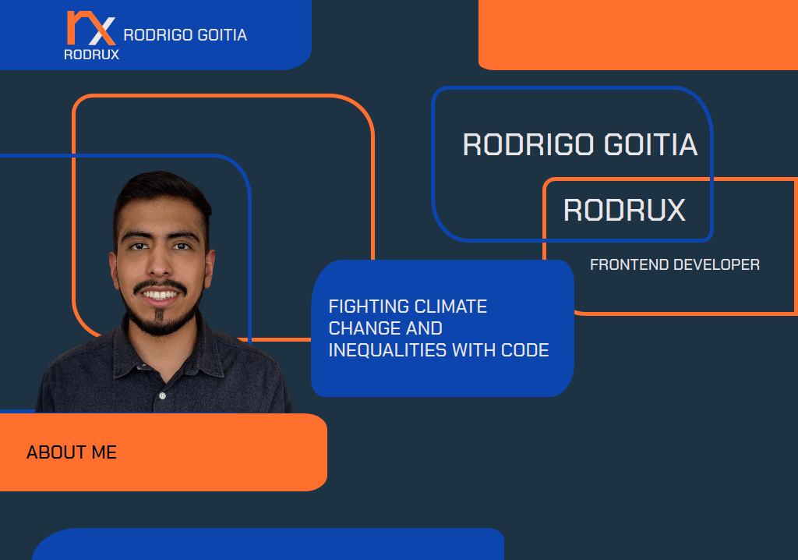

# Personal Portfolio

This is the project for my personal portafolio and blog.

I'd love some feedback in the code and in the design. 💙

You are free to contribute! 🙋‍♂️

## Features

- Show main skills and my technology stack.
- Show my projects in a carousel.
- Show links to my social networks.

## Installation

1. Clone or download the repository.
2. Install all the dependencies with `npm install`.
3. Run the project with `npm run dev`.
4. Go to your browser to [http://localhost:3000/](http://localhost:3000/)

## **Built with**

Technologies used in the project:

- JavaScript
- React.js
- Next.js
- CSS3 - HTML5

## Resources

Some useful resources used in the project are:

- [React Icons](https://react-icons.github.io/react-icons/)

## License

> This project is licensed under the MIT License
> 

## **Author**

Made with 💚 by [rodruxdev](https://twitter.com/rodruxdev)