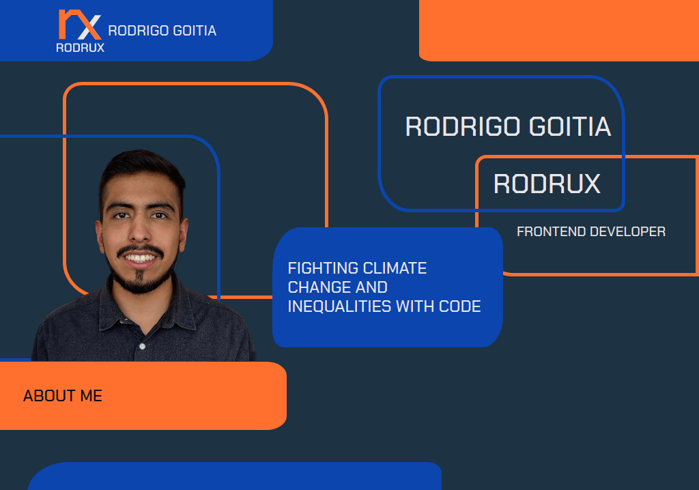

# Personal Portfolio

This is the project for my personal portfolio and blog.

The site is deployed at [www.rodrux.com](https://www.rodrux.com).

You are free to contribute.

## Features

- Show main skills and my technology stack.
- Show links to my social networks.
- Responsive static portfolio page with one interactive Skills island.

## Installation

1. Clone or download the repository.
2. Use Node.js `>=22.12.0` and install pnpm.
3. Install all the dependencies with `pnpm install`.
4. Run the project with `pnpm dev`.
5. Go to [http://localhost:4321/](http://localhost:4321/)

## Built With

Technologies used in the project:

- Astro 6
- React 19
- TypeScript
- pnpm
- CSS3 - HTML5

## Resources

Some useful resources used in the project are:

- [React Icons](https://react-icons.github.io/react-icons/)

## Architecture

The active site is Astro-first. The document shell is in `src/layouts/BaseLayout.astro`, the route is in `src/pages/index.astro`, and static sections are typed Astro components. `src/containers/Skills.tsx` is the only hydrated React island and uses `client:visible`.

The removed Projects carousel is preserved unchanged as a historical reference under `archive/projects/`, including its components, context, hook, data, styles, and six image assets. It is excluded from the active Astro build and lint configuration.

## License

> This project is licensed under the MIT License

## Author

Made by [rodruxdev](https://twitter.com/rodruxdev)
